# Cogway

Cogway is a lifecycle orchestrator for AI coding agents: a router script, a set of
phase rule files, and a canonical agent roster that turn "an agent decides what to
build next" into "a deterministic script decides, and a test suite proves the
decision logic is correct." The routing rules aren't a prompt an agent might
misread — they're bash conditions in `ops/route-initiative.sh`, checked by a real
fixture suite in `ops/tests/`. Don't take that on faith: run
`bash examples/demo-break-a-rule.sh` right now. It copies the router into a scratch
directory, breaks exactly one rule, reruns the full fixture suite against the broken
copy, and shows you the resulting `FAIL` lines — live, in your terminal, without
touching the real router. That's the whole pitch: the orchestrator's own test suite
catches a routing bug, on command.

## Why this exists

Prose rules don't hold for LLM orchestrators — they over-read, improvise, and
confidently do the wrong next thing. Cogway moves routing out of the prompt and
into a tested bash script, and phase gates (discovery → design sprint → build →
monitor → improve → decommission) into explicit fields a script can check, not
verbal approvals an agent has to remember correctly.

## Proof, not just claims

This isn't tested only on fixtures. The same pipeline has directed four real,
shipped products, solo, no engineers on any of them:
[CampBuddy](https://mycampbuddy.app) (iOS app, live on TestFlight, 1300+ tests),
[Stashtrend](https://stashtrend.com) ([source](https://github.com/krulewis/stashtrend)),
[tokencast](https://github.com/krulewis/tokencast) (MIT, shipped OSS), and this
repo. The staff-reviewer + Codex adversarial-review pass this pipeline runs on
every change has caught real bugs across all of them — including a data-loss bug
in this repo's own migration tooling that the test suite had missed, found while
building Cogway itself, using Cogway's own review process.

## Quickstart

```bash
git clone https://github.com/krulewis/cogway.git cogway && cd cogway
```

**1. Run the test suite.** Five scripts cover the router, the deliverable-field
lint, a cross-file consistency check, the schema migration, and the agent-roster
generator, plus a self-test for the secret scanner:

```bash
bash ops/tests/route-initiative-test.sh          # 38 passed, 0 failed
bash ops/tests/check-deliverable-fields-test.sh  # 12 passed, 0 failed
bash ops/tests/field-map-consistency-test.sh     # 11 passed, 0 failed
bash ops/tests/schema-migration-test.sh          # 12 passed, 0 failed
bash agents/generate.sh && bash ops/tests/generate-test.sh
bash scripts/secret-scan-test.sh
```

**2. Run the demo.** Watch the suite catch an intentionally broken rule:

```bash
bash examples/demo-break-a-rule.sh
```

It comments out the D2 rule's action (discovery approved → dispatch design sprint)
in a scratch copy of the router, reruns the fixture suite against that copy, and
prints the `FAIL:` lines for every fixture that depended on D2 — then deletes the
scratch copy on exit. Your real `ops/route-initiative.sh` is never opened for
writing; the demo's own exit code is `0` because successfully showing a red test
*is* the demo working.

**3. Walk the example initiative through a gate.** `examples/walkthrough-initiative/`
is a real, runnable initiative — a discovery spec with an unfilled
`discovery_approved` field, plus a roadmap the router reads. Run it as-is:

```bash
bash ops/route-initiative.sh \
  examples/walkthrough-initiative/docs/initiatives/2026-01-01-example-feature \
  examples/walkthrough-initiative/roadmap.md
```

This prints `D1|escalate|gate-1` — no `discovery_approved` value is set, so the
router escalates to a human decision instead of guessing (see
`ops/rules/orchestrator.md`'s `escalate` section for what happens next).

To see the *next* rule fire (`D2|dispatch|design-sprint`, once discovery is
approved), you need a copy of just the discovery spec — the committed example
folder also has a `01-design-sprint.md` sitting next to it, and D2's condition is
specifically "approved, and no design sprint file exists yet," so editing the field
in place will land on `DS1` (design sprint pending), not `D2`:

```bash
mkdir -p /tmp/cogway-demo && \
  cp examples/walkthrough-initiative/docs/initiatives/2026-01-01-example-feature/00-discovery-spec.md \
     /tmp/cogway-demo/
sed 's/^discovery_approved:$/discovery_approved: approved/' \
  /tmp/cogway-demo/00-discovery-spec.md > /tmp/cogway-demo/tmp && \
  mv /tmp/cogway-demo/tmp /tmp/cogway-demo/00-discovery-spec.md
bash ops/route-initiative.sh /tmp/cogway-demo examples/walkthrough-initiative/roadmap.md
# -> D2|dispatch|design-sprint
rm -rf /tmp/cogway-demo
```

To see the gate *after that* (`DS1|escalate|gate-2`), copy the *whole* initiative
folder this time, not just the discovery spec — a real D2 dispatch would have
produced a design sprint deliverable, and this walkthrough's committed
`01-design-sprint.md` (with its own unfilled `design_approved` field) stands in
for it:

```bash
mkdir -p /tmp/cogway-demo && \
  cp -r examples/walkthrough-initiative/docs/initiatives/2026-01-01-example-feature/. \
     /tmp/cogway-demo/
sed 's/^discovery_approved:$/discovery_approved: approved/' \
  /tmp/cogway-demo/00-discovery-spec.md > /tmp/cogway-demo/tmp && \
  mv /tmp/cogway-demo/tmp /tmp/cogway-demo/00-discovery-spec.md
bash ops/route-initiative.sh /tmp/cogway-demo examples/walkthrough-initiative/roadmap.md
# -> DS1|escalate|gate-2
rm -rf /tmp/cogway-demo
```

Running `route-initiative.sh` directly against the real, unmodified
`examples/walkthrough-initiative/` folder still returns `D1|escalate|gate-1` even
though `01-design-sprint.md` is already sitting there — its discovery spec is
deliberately left unapproved as the walkthrough's starting state, and D2's
approved-discovery precondition has to be met before the design-sprint file's
existence matters at all.

## Lifecycle State Diagram

Built directly from the `assert_rule` pairs in `ops/tests/route-initiative-test.sh`
— rule name on the left, `ACTION|TARGET` on the right. `escalate` nodes are human
gates; `dispatch` nodes hand off to a phase's agent roster (see
`ops/rules/{phase}.md`); `update` nodes are orchestrator-only file edits; `no-op`
means nothing happens this run.

```mermaid
graph TD
    D0["D0: no discovery spec, no feature record"] -->|dispatch| DISCOVERY[discovery phase]
    D1["D1: discovery spec exists, unapproved"] -->|escalate| GATE1[gate-1]
    D1b["D1b: discovery rejected"] -->|update| ARCHIVE1[archive-initiative]
    D2["D2: discovery approved, no design sprint yet"] -->|dispatch| DESIGNSPRINT[design-sprint phase]
    DS1["DS1: design sprint exists, unapproved"] -->|escalate| GATE2[gate-2]
    DS2["DS2: design_approved = iterate"] -->|dispatch| DSITER[design-sprint-iteration]
    DS2b["DS2b: design rejected"] -->|update| ARCHIVE2[archive-initiative]
    DS3["DS3: design approved, new_product, no MVP dir yet"] -->|dispatch| BUILDMVP[build-mvp phase]
    DS4["DS4: design approved, iteration, no experiment report yet"] -->|dispatch| BUILDEXP[build-experiment phase]
    MVP1["MVP1: MVP verdict set, investment decision pending"] -->|escalate| GATE3[gate-3]
    MVP2["MVP2: investment approved, no feature record yet"] -->|dispatch| BUILDFEAT1[build-feature phase]
    MVP3["MVP3: investment rejected, no decommission report yet"] -->|dispatch| DECANALYST1[decommission-analyst]
    EXP0["EXP0: experiment report exists, verdict pending"] -->|no-op| NOOP1[stay in build-experiment]
    EXP1["EXP1: verdict = promote, no feature record yet"] -->|dispatch| BUILDFEAT2[build-feature phase]
    EXP2["EXP2: verdict = kill, no decommission report yet"] -->|dispatch| DECANALYST2[decommission-analyst]
    EXP3["EXP3: verdict = extend, extensions < 2"] -->|update| EXTENDEXP[extend-experiment]
    EXP4["EXP4: verdict = extend, extensions >= 2"] -->|escalate| GATE3B[gate-exp-inconclusive]
    BF0["BF0: feature record exists, build in_progress"] -->|no-op| NOOP2[stay in build-feature]
    BF1["BF1: build complete, baseline+thresholds set, no signals/improvements yet"] -->|update| MONITOR[begin-monitor]
    MON1["MON1: signal = trigger_improve_urgent"] -->|dispatch| IMPROVEURGENT[improve-urgent]
    MON2["MON2: signal = trigger_improve"] -->|dispatch| IMPROVE[improve phase]
    MON3["MON3: signal = stable"] -->|no-op| NOOP3[stay in monitor]
    IMP1["IMP1: mini_design_sprint_triggered, status pending"] -->|dispatch| MINISPRINT[mini-design-sprint]
    IMP2["IMP2: improvement recommends flag_decommission"] -->|dispatch| DECANALYST3[decommission-analyst]
    IMP3["IMP3: recommendation = stable or continue_improve"] -->|update| RETURNMONITOR[return-to-monitor]
    DEC1["DEC1: decommission report exists, unapproved"] -->|escalate| GATE4[gate-decommission]
    DEC2["DEC2: decommission approved"] -->|dispatch| DECEXEC[decommission-executor]
    DEC3["DEC3: decommission rejected"] -->|update| RETURNMONITOR2[return-to-monitor]
    FALLBACK["FALLBACK: no rule matched"] -->|escalate| HUMAN[human]
```



The test suite also runs 6 legacy bold-markdown fixtures (`*-legacy-bold`) proving
the router still parses the pre-frontmatter `**field:** value` format, plus one
`frontmatter-inline-comment` fixture exercising the comment-trim edge case
documented in `ops/rules/orchestrator.md` — 38 assertions total, all in
`ops/tests/route-initiative-test.sh`.

## Architecture

- **`AGENTS.md`** — the thin bootstrap adapter. Points any harness at the router
  and the skill; kept deliberately small (under a few hundred bytes) so it never
  approaches the 32768-byte size gate CI enforces.
- **`skills/orchestrator/SKILL.md`** — the step-by-step orchestrator procedure:
  call the router, branch on `ACTION`, read the matching `ops/rules/{phase}.md`
  file on demand, update `roadmap.md`.
- **`ops/`** — the enforcement layer. `route-initiative.sh` (the router),
  `check-deliverable-fields.sh` (write-side field lint), `rules/` (11 phase rule
  files ported from the personal system, minus the two that were entirely
  client/billing-facing), `schemas/` (8 deliverable frontmatter schemas),
  `templates/` (initiative folder skeletons), and `tests/` (the fixture suite
  covering all of the above).

Everything under `ops/` is plain bash and markdown — no Node, no Python, no
dependency to install before the router runs.

## Platform Support

| Platform | Status | Notes |
|---|---|---|
| **Claude Code** | Flagship | Agent roster generated to `.claude/agents/*.md`. Team primitives (roster dispatch, task tracking) and `PreToolUse` hook patterns are documented in `adapters/claude-code/README.md`; `settings.json.example` is an illustrative skeleton, not a real config. |
| **Codex** | Supported | Agent roster generated to `.codex/agents/*.toml`. Runs the same router and rule files. `hooks.json.example` ships **documented but off** — Codex's hook mechanism is experimental, off by default, and has no Windows support, so no lifecycle gate in Cogway depends on it (see `adapters/codex/README.md`). Model-name and tools-grant-key mappings in generated `.toml` files carry `VERIFY-AT-BUILD-TIME` comments pending confirmation against a real Codex CLI install. |

Other harnesses mentioned in earlier planning (Copilot, Cursor, Antigravity) are
**deferred, not silently unsupported** — Cogway does not claim to run identically
across every possible agent harness. Two platforms are built and tested; more may
follow.

Run `agents/generate.sh` from the repo root to populate both `.claude/agents/` and
`.codex/agents/` from the 36 canonical sources in `agents/_canonical/`. Both output
directories are gitignored — they're generated, not hand-maintained — so re-run the
generator any time a canonical source changes.

## Security

`scripts/secret-scan.sh` is the single source of truth for secret detection —
pattern-based (AWS keys, generic `key:`/`token:`/`password:`-shaped assignments,
PEM private-key headers), no external dependency. CI job 3 runs it on every
push/PR. It is also meant to be run by hand — `bash scripts/secret-scan.sh .` —
before pushing new history to the public remote, so a leaked secret is caught
before it lands in public history rather than after; this local run is a
documented required step, not (yet) an installed git hook.

## License

MIT — Copyright (c) 2026 Kelly Lewis. See `LICENSE`.

## Contributing

Cogway is maintained by one person, and the contract is explicit: the router and
its test suite. A change to `ops/route-initiative.sh` isn't done until
`ops/tests/route-initiative-test.sh` (and the fixture it needs) reflects it. Start
by reading `AGENTS.md` and `skills/orchestrator/SKILL.md`, then `ops/rules/` for
the phase you're touching.

Open items:
- Codex model-name and tools-grant-key mappings need verification against a real
  Codex CLI install (see the `VERIFY-AT-BUILD-TIME` markers in generated
  `.codex/agents/*.toml`).
- Adapters beyond Claude Code and Codex are not yet built.
